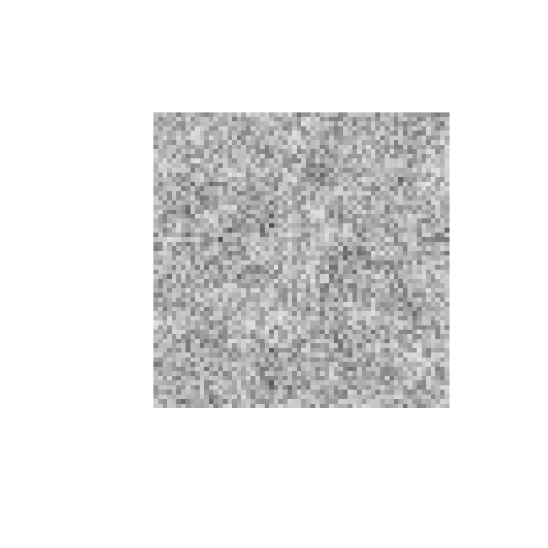

# Getting started with rcicr

`rcicr` implements **reverse correlation image classification**, a
technique from psychophysics for visualizing internal mental
representations (for example, of faces). It works in two stages:

1.  **Stimulus generation**: a base image (e.g. a face photo) is
    combined with random visual noise to create pairs of stimuli — an
    “original” and its pixel-inverted counterpart — for a
    two-image-forced-choice (2IFC) task. Participants pick, on each
    trial, whichever of the pair looks more like some target category
    (e.g. “trustworthy”, “happy”).
2.  **Classification image (CI) computation**: after data collection,
    the noise patterns from stimuli where the participant chose the
    “original” are averaged together (and subtracted for stimuli where
    the “inverted” version was chosen). The result — the classification
    image — visualizes which visual features were systematically
    associated with the participant’s choices.

This vignette walks through both stages using a tiny synthetic example.
For the full treatment — several participants, scaling choices, z-maps
and informational value — see
[`vignette("reverse-correlation-walkthrough", package = "rcicr")`](https://rdotsch.github.io/rcicr/articles/reverse-correlation-walkthrough.md).
For example datasets and analysis scripts, see
[rcicr_examples](https://github.com/rdotsch/rcicr_examples/).

``` r

library(rcicr)
```

## 1. Generate stimuli

[`generateStimuli2IFC()`](https://rdotsch.github.io/rcicr/reference/generateStimuli2IFC.md)
needs a square base image. Here we generate a synthetic grayscale image
instead of using a real photo, purely so this vignette is
self-contained; in a real study you would pass the path to your base
face photo(s) instead.

``` r

set.seed(42)
base_face_path <- tempfile(fileext = ".png")
png::writePNG(matrix(runif(64 * 64), 64, 64), base_face_path)
```

Now generate stimuli for a small task: 20 trials, one base image, at a
small image size (kept small here so the vignette builds quickly — a
real study would typically use `img_size = 512` and several hundred
trials, following Dotsch & Todorov, 2012).

``` r

stimulus_path <- tempdir()

generateStimuli2IFC(
  base_face_files = list(face = base_face_path),
  n_trials        = 20,
  img_size        = 64,
  stimulus_path   = stimulus_path,
  seed            = 1,
  ncores          = 1,
  save_as_png     = FALSE # set to TRUE to also write stimulus PNGs to stimulus_path
)

rdata_file <- list.files(stimulus_path, pattern = "\\.Rdata$", full.names = TRUE)[1]
```

This writes an `.Rdata` file to `stimulus_path` containing the random
noise parameters used for every trial. **That file is the only link
between stimulus generation and CI computation** — keep it, since every
analysis function below needs it via the `rdata` argument.

## 2. Collect (or, here, simulate) responses

In a real experiment, this is where you would run the 2IFC task and
record which image (original = `1`, inverted = `-1`) each participant
chose on each trial. Since this vignette has no real participant, we
simulate random responses instead — a real analysis would never do this,
as random responding contains no signal and yields an uninformative
classification image.

``` r

responses <- sample(c(1, -1), 20, replace = TRUE)
```

## 3. Compute the classification image

[`generateCI()`](https://rdotsch.github.io/rcicr/reference/generateCI.md)
looks up the noise parameters for the stimuli that were shown, weights
them by the responses, and averages them into a single classification
image.

``` r

ci <- generateCI(
  stimuli     = 1:20,
  responses   = responses,
  baseimage   = "face",
  rdata       = rdata_file,
  save_as_png = FALSE
)

names(ci)
#> [1] "ci"       "scaled"   "base"     "combined"
```

`ci$ci` is the raw noise, `ci$scaled` is that noise rescaled for display
(see
[`?generateCI`](https://rdotsch.github.io/rcicr/reference/generateCI.md)
for the available scaling methods — the default, `'independent'`, picks
the lowest scaling constant that avoids clipping this particular image),
and `ci$combined` overlays the scaled noise on the base image.

``` r

image(ci$combined, col = gray.colors(256), axes = FALSE, asp = 1)
```



Because the responses above were random rather than real data, this
classification image is just noise — with real experimental data,
systematic patterns tied to participants’ choices would emerge here
instead.

## Next steps

- [`batchGenerateCI()`](https://rdotsch.github.io/rcicr/reference/batchGenerateCI.md)
  /
  [`batchGenerateCI2IFC()`](https://rdotsch.github.io/rcicr/reference/batchGenerateCI2IFC.md)
  compute one CI per participant or condition from a data frame,
  optionally followed by
  [`autoscale()`](https://rdotsch.github.io/rcicr/reference/autoscale.md)
  to rescale a whole batch of CIs consistently so they stay visually
  comparable.
- [`computeInfoVal2IFC()`](https://rdotsch.github.io/rcicr/reference/computeInfoVal2IFC.md)
  computes an “Informational Value” (a z-score-like measure of how much
  signal is in a CI) by comparing it to a simulated null distribution.
- [`plotZmap()`](https://rdotsch.github.io/rcicr/reference/plotZmap.md)
  visualizes which regions of a CI carry statistically reliable signal.

See each function’s help page
(e.g. [`?generateCI`](https://rdotsch.github.io/rcicr/reference/generateCI.md),
[`?batchGenerateCI`](https://rdotsch.github.io/rcicr/reference/batchGenerateCI.md))
for further options and runnable examples.
