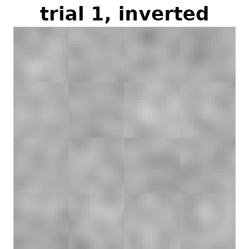
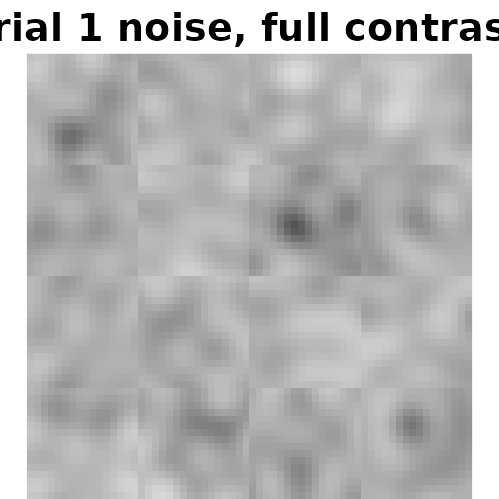
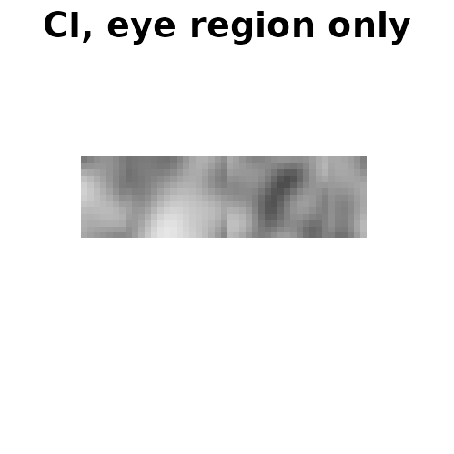

# Recipes

Short answers to questions that come up once the basics in
[`vignette("reverse-correlation-walkthrough")`](https://rdotsch.github.io/rcicr/articles/reverse-correlation-walkthrough.md)
are in place. Each recipe runs at a small size so this vignette builds
in seconds; real studies use `img_size = 512` and several hundred
trials.

``` r

library(rcicr)
```

## A stimulus set and a simulated participant

The recipes share one stimulus set: a synthetic face (no photo, so no
image licence) and 120 trials.

``` r

n <- 64
x <- matrix(seq(-1, 1, length.out = n), n, n, byrow = TRUE)
y <- -matrix(seq(-1, 1, length.out = n), n, n)
face <- exp(-(x^2 / 0.45 + y^2 / 0.75))
face <- face - 0.55 * exp(-(((x + 0.3)^2 + (y - 0.25)^2) / 0.012))
face <- face - 0.55 * exp(-(((x - 0.3)^2 + (y - 0.25)^2) / 0.012))
face <- face - 0.35 * exp(-(x^2 / 0.10 + (y + 0.42)^2 / 0.006))
face <- (face - min(face)) / (max(face) - min(face))
base_face <- tempfile(fileext = ".png")
png::writePNG(face, base_face)

stimulus_path <- tempfile("stimuli")
generateStimuli2IFC(list(face = base_face), n_trials = 120, img_size = n,
                    stimulus_path = stimulus_path, seed = 1, nscales = 3,
                    ncores = 1, save_as_png = FALSE)
rdata_file <- list.files(stimulus_path, pattern = "\\.Rdata$", full.names = TRUE)[1]
```

So that the results show something, a simulated participant responds
according to a hidden template. `evidence` is how strongly each trial’s
noise matches it.

``` r

e <- new.env()
load(rdata_file, envir = e)
set.seed(99)
template <- generateNoiseImage(rnorm(max(e$p$patchIdx)), e$p)
evidence <- vapply(seq_len(120), function(i) {
  base::sum(generateNoiseImage(e$stimuli_params$face[i, ], e$p) * template)
}, numeric(1))
evidence <- evidence / sd(evidence)
set.seed(7)
choice <- ifelse(evidence + rnorm(120) > 0, 1, -1) # 1: original chosen, -1: inverted
```

## Noise-only stimuli

To show noise without a face (for a task about textures, say, or to
inspect the noise itself), use a uniform mid-grey base image. A uniform
image has no contrast to maximize, so pass
`maximize_baseimage_contrast = FALSE`.

``` r

grey <- tempfile(fileext = ".png")
png::writePNG(matrix(0.5, n, n), grey)
noise_path <- tempfile("noise")
generateStimuli2IFC(list(grey = grey), n_trials = 4, img_size = n,
                    stimulus_path = noise_path, seed = 1, nscales = 3, ncores = 1,
                    maximize_baseimage_contrast = FALSE)
```

``` r

ori <- png::readPNG(file.path(noise_path, "rcic_grey_1_00001_ori.png"))
inv <- png::readPNG(file.path(noise_path, "rcic_grey_1_00001_inv.png"))
show(ori, "trial 1, original", zlim = c(0, 1))
show(inv, "trial 1, inverted", zlim = c(0, 1))
```



These are ordinary 2IFC stimuli: the stimulus PNGs average the noise
with the base, so on a grey base the noise appears at half contrast, and
the `.Rdata` file is analysed as usual. For the noise at full contrast,
for display rather than for a task, ask for it back as a data frame, one
column per trial:

``` r

noise <- generateStimuli2IFC(list(grey = grey), n_trials = 4, img_size = n, seed = 1,
                             nscales = 3, ncores = 1, return_as_dataframe = TRUE,
                             maximize_baseimage_contrast = FALSE,
                             save_as_png = FALSE, save_rdata = FALSE)
```

``` r

# The same scaling the stimuli use, without the base: most noise falls in [-0.3, 0.3].
noise_1 <- pmin(pmax((matrix(noise[[1]], n, n) + 0.3) / 0.6, 0), 1)
show(noise_1, "trial 1 noise, full contrast", zlim = c(0, 1))
```



## Ratings instead of a two-image choice

[`generateCI()`](https://rdotsch.github.io/rcicr/reference/generateCI.md)
weights each trial’s noise by its response, so any numeric response
works, not only `1`/`-1`. If participants rated each stimulus on a
scale, recode the scale so that its midpoint is 0 and its direction is
the one you want the classification image to show. Here a 1–4 scale
(“not at all” to “very much”) is recoded to -2, -1, 1, 2:

``` r

set.seed(11)
rating <- as.integer(cut(evidence + rnorm(120, 0, 0.7), c(-Inf, -0.7, 0, 0.7, Inf)))
table(rating)
#> rating
#>  1  2  3  4 
#> 34 30 26 30

ci_rating <- generateCI(1:120, c(-2, -1, 1, 2)[rating], "face", rdata_file,
                        save_as_png = FALSE)
cor(as.vector(ci_rating$ci), as.vector(template))
#> [1] 0.5764985
```

**Check the direction.** Recoded the wrong way round, the scale gives
the anti-classification image, and that looks like a plausible face too.
With real data there is no template to compare against: compare instead
with a CI whose direction you know, such as a 2IFC CI for the same
target, or check that the expected features appear.

Responses must be numeric and complete. A missing rating, a factor, or
`TRUE`/`FALSE` stops
[`generateCI()`](https://rdotsch.github.io/rcicr/reference/generateCI.md)
with an error naming the trials, rather than returning an image of
`NA`s. Drop unanswered trials from `stimuli` and `responses` alike.

## Matching the InfoVal reference to the design

[`computeInfoVal2IFC()`](https://rdotsch.github.io/rcicr/reference/computeInfoVal2IFC.md)
compares a classification image with a reference distribution: CIs built
from random responses. The reference must match the CI’s design. When it
does not, the InfoVal is miscalibrated.

### When some trials were dropped

Say 20 trials were dropped because the participant did not respond in
time. The CI is built from 100 stimuli; the default reference uses all
120.

``` r

kept <- setdiff(1:120, seq(3, 120, by = 6))
ci_kept <- generateCI(kept, choice[kept], "face", rdata_file, save_as_png = FALSE)
attr(ci_kept, "trial_design")$stimuli[1:10]
#>  [1]  1  2  4  5  6  7  8 10 11 12
```

[`generateCI()`](https://rdotsch.github.io/rcicr/reference/generateCI.md)
records the stimuli it used, so the matching reference is one argument
away. The default call says the two differ:

``` r

default <- computeInfoVal2IFC(ci_kept, rdata_file, iter = 10000)
#> This classification image was built from 100 of the 120 saved stimuli, but the reference is built over 120. Brinkman et al. (2019) require the reference to use the stimuli the CI was built from. To score it that way, pass reference_stimuli = attr(<your CI>, "trial_design")$stimuli.
#> InfoVal reference computed with reference_method = "gram". References from rcicr 1.5.0 and earlier used "images"; pass reference_method = "images" to reproduce them bit for bit.
matched <- computeInfoVal2IFC(ci_kept, rdata_file, iter = 10000,
                              reference_stimuli = attr(ci_kept, "trial_design")$stimuli)
#> InfoVal reference computed with reference_method = "gram". References from rcicr 1.5.0 and earlier used "images"; pass reference_method = "images" to reproduce them bit for bit.
```

``` r

c(default = default, matched = matched)
#>  default  matched 
#> 3.837017 2.423099
```

Fewer stimuli give a noisier CI, so its norm is larger under random
responding too: against the full-set reference, the default InfoVal is
inflated. Each reference is simulated once and stored in the `.Rdata`
file for later calls.

### A masked classification image

A CI computed with a `mask` holds `NA` in the masked pixels. Its InfoVal
is computed over the unmasked pixels, against a reference over the same
pixels. Here only the eye region is kept (in a mask, `0` is masked):

``` r

mask <- matrix(0, n, n)
mask[18:30, 10:54] <- 1
ci_eyes <- generateCI(1:120, choice, "face", rdata_file, mask = mask, save_as_png = FALSE)
infoval_eyes <- computeInfoVal2IFC(ci_eyes, rdata_file, iter = 10000)
#> InfoVal reference computed with reference_method = "gram". References from rcicr 1.5.0 and earlier used "images"; pass reference_method = "images" to reproduce them bit for bit.
```

``` r

show(ci_eyes$ci, "CI, eye region only")
```



``` r

infoval_eyes
#> [1] 1.384019
```

An InfoVal over part of the image is not comparable with one over the
whole image.

### Several classification images at once

[`batchComputeInfoVal2IFC()`](https://rdotsch.github.io/rcicr/reference/batchComputeInfoVal2IFC.md)
scores a list of CIs, such as the result of
[`batchGenerateCI2IFC()`](https://rdotsch.github.io/rcicr/reference/batchGenerateCI2IFC.md),
and simulates each distinct reference once:

``` r

set.seed(3)
data <- data.frame(
  participant = rep(c("p1", "p2", "p3"), each = 120),
  stimulus    = rep(1:120, 3),
  response    = c(ifelse(evidence + rnorm(120, 0, 0.5) > 0, 1, -1),
                  ifelse(evidence + rnorm(120, 0, 2) > 0, 1, -1),
                  sample(c(1, -1), 120, replace = TRUE))
)
cis <- batchGenerateCI2IFC(data, "participant", "stimulus", "response", "face",
                           rdata_file, save_as_png = FALSE)
infovals <- batchComputeInfoVal2IFC(cis, rdata_file, iter = 10000)
```

``` r

round(infovals, 2)
#> face_participant_p1 face_participant_p2 face_participant_p3 
#>                6.32                0.73                0.20
```

The third participant answered at random, and scores near 0.

### A CI averaged over participants

No reference is defined for a CI that averages several participants (or
repeated presentations of the same stimulus): every reference assumes
one response per stimulus from one responder.
[`computeInfoVal2IFC()`](https://rdotsch.github.io/rcicr/reference/computeInfoVal2IFC.md)
returns a number but says it is not calibrated.

``` r

ci_group <- generateCI(data$stimulus, data$response, "face", rdata_file,
                       participants = data$participant, save_as_png = FALSE, n_cores = 1)
infoval_group <- computeInfoVal2IFC(ci_group, rdata_file, iter = 10000)
#> This classification image averages 3 participants. Every InfoVal reference in rcicr assumes one response per stimulus from one responder, and none is defined for this design, so this InfoVal is not calibrated for it. Where each participant saw every stimulus once, compute InfoVal for each participant's own CI instead.
```

``` r

infoval_group
#> [1] -3.524378
```

Averaging shrinks the CI’s norm, so against a single-responder reference
the group CI scores below zero, although one of its participants scored
6.3 on their own. Score each participant’s own CI instead, as above.
