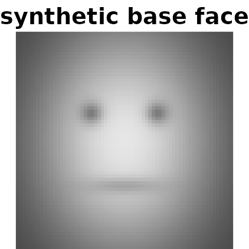
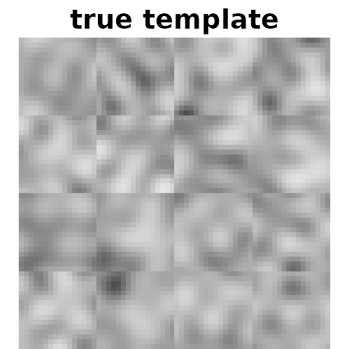
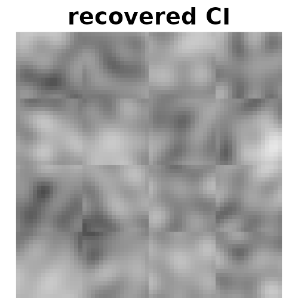
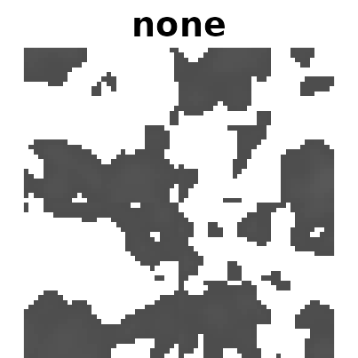
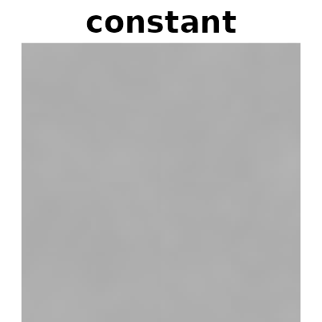
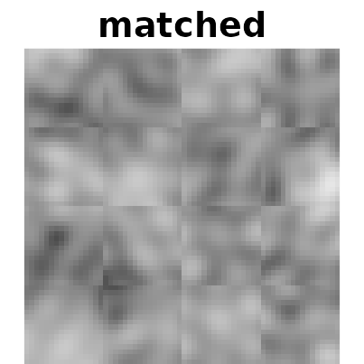
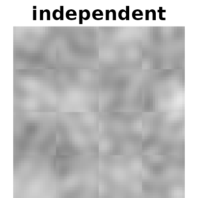
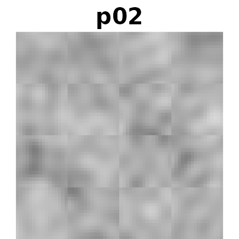
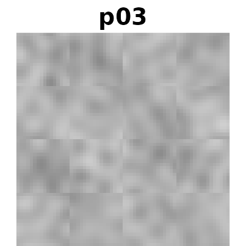
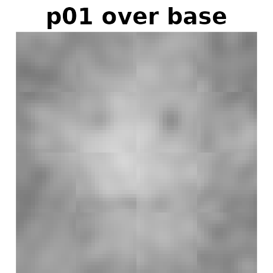

# A reverse correlation walkthrough

This is the full walkthrough: designing a 2IFC reverse correlation
study, generating stimuli, computing classification images for several
participants, scaling them so they can be compared, and deciding whether
what you are looking at is signal or noise.

If you only want the shortest possible working example, read
[`vignette("getting-started", package = "rcicr")`](https://rdotsch.github.io/rcicr/articles/getting-started.md)
instead.

Every code chunk here runs when this vignette is built, so the code
cannot silently drift out of date as the package changes. That matters:
an earlier version of this walkthrough lived outside the package, and by
the time it was brought in, two of its lines no longer worked —
[`autoscale()`](https://rdotsch.github.io/rcicr/reference/autoscale.md)’s
argument had been renamed, and the install instruction pointed at a
branch that no longer exists.

``` r

library(rcicr)

# CRAN asks that a vignette restore any graphical parameters it changes, so this
# records them and the last chunk puts them back. The show() helper below already
# restores the margins it sets, so this pair is a safety net -- and the pattern to
# copy into your own scripts.
old_par <- par(no.readonly = TRUE)
```

One small helper, used throughout to display an image matrix:

``` r

# zlim matters more than it looks. image() stretches whatever range it is given
# across the full palette, so without a fixed zlim every linear rescaling of the
# same image renders identically -- which would make the scaling comparison
# below silently meaningless. Pass zlim = c(0, 1) whenever the point is what the
# pixel values actually are; the default just stretches to the data's own range,
# which is what you want when only the structure matters.
show <- function(m, title, zlim = range(m, na.rm = TRUE)) {
  op <- par(mar = c(0, 0, 1.4, 0))
  # image() takes [x, y] with y increasing upwards, so a matrix indexed
  # [row, col] has to be transposed and flipped to display the right way up.
  image(t(m[nrow(m):1, ]), col = gray.colors(256), axes = FALSE, asp = 1, # nolint: seq_linter.
        main = title, zlim = zlim, useRaster = TRUE)
  par(op)
}
```

## 1. Installing

`rcicr` was archived on CRAN in 2021 (an undeliverable maintainer email
address, not a problem with the package), so install it from GitHub:

``` r

# install.packages("remotes")
remotes::install_github("rdotsch/rcicr@*release")   # or @v1.3.0 for one specific release
```

Install a tagged release rather than the tip of `main`, and note the
version in your analysis script: a classification image is only
reproducible against the version that computed it.

## 2. What the method does

On each trial a participant sees two images side by side. Both are the
same base face, but one has random visual noise added and the other has
*exactly the same noise subtracted*. The participant picks whichever
looks more like some category — more trustworthy, more masculine, more
like their own group.

Neither image contains any real signal. But if a participant reliably
picks the image whose noise happens to resemble their internal idea of
“trustworthy”, then averaging the noise from their chosen images — and
subtracting the noise from the ones they rejected — makes that idea
visible. That average is the **classification image**.

## 3. Generating stimuli

[`generateStimuli2IFC()`](https://rdotsch.github.io/rcicr/reference/generateStimuli2IFC.md)
needs one or more **square** base images. Here we draw a crude synthetic
face so the vignette is self-contained and needs no image licence; in a
real study you would pass paths to your face photos.

``` r

n <- 64
rows <- matrix(seq(-1, 1, length.out = n), n, n)
cols <- matrix(seq(-1, 1, length.out = n), n, n, byrow = TRUE)
x <- cols
y <- -rows # row indices grow downwards, so flip to make +y point up

face <- exp(-(x^2 / 0.45 + y^2 / 0.75))                            # head
face <- face - 0.55 * exp(-(((x + 0.3)^2 + (y - 0.25)^2) / 0.012)) # left eye
face <- face - 0.55 * exp(-(((x - 0.3)^2 + (y - 0.25)^2) / 0.012)) # right eye
face <- face - 0.35 * exp(-(x^2 / 0.10 + (y + 0.42)^2 / 0.006))    # mouth
face <- (face - min(face)) / (max(face) - min(face))

base_face <- tempfile(fileext = ".png")
png::writePNG(face, base_face)

show(face, "synthetic base face", zlim = c(0, 1))
```



The base image must be **square and already the size you want**: `rcicr`
does not resize it, and will stop with an error if `img_size` disagrees.

``` r

stimulus_path <- tempfile("stimuli")
dir.create(stimulus_path)

generateStimuli2IFC(
  base_face_files = list(face = base_face),
  n_trials        = 120,
  img_size        = 64,
  stimulus_path   = stimulus_path,
  seed            = 1,
  nscales         = 3,
  ncores          = 1,
  save_as_png     = FALSE # TRUE in a real study: this writes the actual stimuli
)

rdata_file <- list.files(stimulus_path, pattern = "\\.Rdata$", full.names = TRUE)[1]
```

**Real studies are much bigger than this.** The defaults —
`n_trials = 770`, `img_size = 512`, `nscales = 5` — reflect published
practice (Dotsch & Todorov, 2012). Everything here is shrunk so the
vignette builds in seconds.

With `save_as_png = TRUE` you get two PNGs per trial per base image:
`..._ori.png` and `..._inv.png`. Those are what you show participants.

### The `.Rdata` file is the important output

That file records the random noise parameters behind every trial. **It
is the only link between stimulus generation and analysis** — without
it, the responses you collect are uninterpretable, because nothing else
records which noise pattern trial 57 actually was.

Back it up alongside your data. Every analysis function below takes it
as `rdata`.

## 4. Collecting responses

Run the task however you like (see “Running the task online” below).
What you need back, per trial, is:

- the **stimulus number** — which trial of the generated set was shown,
  and
- the **response** — `1` if the participant chose the original, `-1` if
  they chose the inverted one.

To make this walkthrough show a real result rather than a grey smudge,
we simulate three participants who genuinely have an internal template
and respond according to it, with different amounts of inconsistency.

``` r

e <- new.env()
load(rdata_file, envir = e)
params <- e$stimuli_params[["face"]]

# The template is itself a noise image, so it is exactly expressible in the same
# basis the stimuli are drawn from.
set.seed(99)
template <- generateNoiseImage(rnorm(max(e$p$patchIdx)), e$p)

# Each trial's noise image, and how strongly it matches the template.
stack <- vapply(seq_len(nrow(params)),
                function(i) generateNoiseImage(params[i, ], e$p),
                matrix(0, 64, 64))
evidence <- apply(stack, 3, function(z) base::sum(z * template))
evidence <- evidence / sd(evidence)

# Three observers with the same template but increasing internal noise: the
# third is much less consistent than the first.
set.seed(7)
simulate <- function(internal_noise) {
  ifelse(evidence + rnorm(length(evidence), 0, internal_noise) > 0, 1, -1)
}

responses <- data.frame(
  participant = rep(c("p01", "p02", "p03"), each = nrow(params)),
  stimulus    = rep(seq_len(nrow(params)), 3),
  response    = c(simulate(0.5), simulate(1.5), simulate(3))
)

head(responses)
#>   participant stimulus response
#> 1         p01        1        1
#> 2         p01        2        1
#> 3         p01        3       -1
#> 4         p01        4       -1
#> 5         p01        5        1
#> 6         p01        6        1
```

Real data goes in exactly this shape: one row per trial per participant.

## 5. Computing one classification image

``` r

ci_p01 <- generateCI(
  stimuli     = responses$stimulus[responses$participant == "p01"],
  responses   = responses$response[responses$participant == "p01"],
  baseimage   = "face",
  rdata       = rdata_file,
  save_as_png = FALSE
)

names(ci_p01)
#> [1] "ci"       "scaled"   "base"     "combined"
```

The returned list has four parts, and the distinction between the first
two matters:

- **`ci`** — the raw classification image. **This is the data.** Compute
  statistics from it.
- **`scaled`** — `ci` rescaled into the 0–1 range a PNG can store. This
  is a *display* transformation; which one you pick changes how the
  image looks, not what it means.
- **`base`** — the base image.
- **`combined`** — `scaled` overlaid on `base`. This is what gets
  written to disk.

Did we recover the template the simulated observer was using?

``` r

show(template, "true template")
show(ci_p01$ci, "recovered CI")
```



``` r

cor(as.vector(ci_p01$ci), as.vector(template))
#> [1] 0.5453478
```

With real participants you have no template to compare against — that is
the entire point of the technique. Section 8 covers how to tell signal
from noise when you cannot peek at the answer.

[`generateCI2IFC()`](https://rdotsch.github.io/rcicr/reference/generateCI2IFC.md)
does the same thing with an older argument list, kept so that analysis
scripts written years ago still run. New code should use
[`generateCI()`](https://rdotsch.github.io/rcicr/reference/generateCI.md).

## 6. Scaling

Scaling decides what the image looks like.
[`generateCI()`](https://rdotsch.github.io/rcicr/reference/generateCI.md)
offers four methods, and the choice is a reporting decision, not a
cosmetic one.

``` r

for (method in c("none", "constant", "matched", "independent")) {
  res <- generateCI(
    stimuli     = responses$stimulus[responses$participant == "p01"],
    responses   = responses$response[responses$participant == "p01"],
    baseimage   = "face", rdata = rdata_file, save_as_png = FALSE,
    scaling     = method, scaling_constant = 0.5
  )
  # $scaled, not $combined, so the effect of scaling is visible rather than
  # hidden under the base image -- and zlim fixed to the displayable range, so
  # that what you see is the actual pixel values.
  show(res$scaled, method, zlim = c(0, 1))
}
```



Those four panels are the argument for taking scaling seriously.

**`none`** leaves the raw CI, whose values straddle zero and span only
about ±0.04. Nothing in that range is displayable: negative pixels fall
outside 0–1 entirely (shown blank above) and positive ones are so close
to zero they render as near-black. Written to a PNG, where out-of-range
values are clipped rather than dropped, almost the whole image would be
black. Scaling is not optional.

**`constant`** with `scaling_constant = 0.5` gives a flat grey — the
constant is more than ten times the CI’s actual range, so every
difference is compressed into a sliver of the palette. A constant has to
be chosen with the data’s range in mind; too large destroys the signal
just as surely as too small clips it.

**`matched`** and **`independent`** both use the available range and
look similar here, because the base image happens to span nearly 0–1
already. On a real photograph with a narrower range they diverge.

- **`independent`** (default) picks, for each image separately, the
  smallest constant that avoids clipping. Every CI uses its full dynamic
  range — which means **two CIs scaled this way are not comparable to
  each other**, because each got a different constant.
- **`constant`** divides by a fixed constant you choose, so several CIs
  stay on one scale. Use this, or
  [`autoscale()`](https://rdotsch.github.io/rcicr/reference/autoscale.md),
  when comparing conditions.
- **`matched`** matches the CI’s intensity range to the base image’s.
  Nonlinear.
- **`none`** does nothing, leaving values outside 0–1 to be clipped on
  save.

Whichever you choose, `ci$ci` is untouched. Statistics computed from it
are unaffected by the display choice.

## 7. Several participants at once

[`batchGenerateCI()`](https://rdotsch.github.io/rcicr/reference/batchGenerateCI.md)
splits a data frame by a grouping column and computes one CI per group.

``` r

cis <- batchGenerateCI(
  data        = responses,
  by          = "participant",
  stimuli     = "stimulus",
  responses   = "response",
  baseimage   = "face",
  rdata       = rdata_file,
  save_as_png = FALSE
)
```

``` r

names(cis)
#> [1] "face_participant_p01" "face_participant_p02" "face_participant_p03"
```

Use the same `by` mechanism for conditions rather than participants when
that is the comparison you care about.

Because each of those was scaled independently, they cannot be compared
by eye yet.
[`autoscale()`](https://rdotsch.github.io/rcicr/reference/autoscale.md)
finds one constant that works for all of them without clipping any:

``` r

scaled <- autoscale(cis, save_as_pngs = FALSE)
#> Using scaling factor constant:0.0384382346907274

for (nm in names(scaled)) {
  # $scaled, not $combined -- see the note below.
  show(scaled[[nm]]$scaled, sub(".*_", "", nm), zlim = c(0, 1))
}
```



`p01` should look cleanest and `p03` weakest — they share a template but
differ in how consistently they applied it, which is what internal noise
means in practice.

### After `autoscale()`, look at `$scaled`

[`autoscale()`](https://rdotsch.github.io/rcicr/reference/autoscale.md)
rewrites `$scaled` and **deliberately leaves `$combined` exactly as it
was**. That is by design: a combination you made before autoscaling
survives the call untouched, so an existing analysis script that plots
`$combined` keeps producing the same image.

It catches people out after
[`batchGenerateCI()`](https://rdotsch.github.io/rcicr/reference/batchGenerateCI.md),
though, because that function scales with `'none'` before handing over —
so its `$combined` is an overlay of the *unscaled* noise and looks
almost blank. If you want the autoscaled noise over the base image,
build it yourself:

``` r

p01 <- scaled[["face_participant_p01"]]
show((p01$scaled + p01$base) / 2, "p01 over base", zlim = c(0, 1))
```



That expression is exactly what `autoscale(save_as_pngs = TRUE)` writes
to disk.

Note also that the argument is `save_as_pngs`. Older tutorials show
`saveasjpegs`, which no longer exists — precisely the drift that keeping
this walkthrough inside the package prevents.

## 8. Is there actually signal?

Two tools, answering different questions.

**[`computeInfoVal2IFC()`](https://rdotsch.github.io/rcicr/reference/computeInfoVal2IFC.md)**
gives one number per CI: a z-score for how much stronger this CI is than
one built from random responding. Values above about 1.96 indicate
reliable signal.

It needs a reference distribution simulated under the same task
parameters, which takes a long time to build — so it is shown but not
run here:

``` r

# Slow: simulates `iter` classification images from random responses. Do this once
# per stimulus set; the result is cached back into the .Rdata file.
generateReferenceDistribution2IFC(rdata_file, iter = 10000)

computeInfoVal2IFC(target_ci = ci_p01, rdata = rdata_file)
```

**[`plotZmap()`](https://rdotsch.github.io/rcicr/reference/plotZmap.md)**,
or `generateCI(zmap = TRUE)`, answers the spatial question instead:
*which regions* of the image carry reliable signal.

``` r

zmap_dir <- tempfile("zmaps")

ci_z <- generateCI(
  stimuli     = responses$stimulus[responses$participant == "p01"],
  responses   = responses$response[responses$participant == "p01"],
  baseimage   = "face", rdata = rdata_file, save_as_png = FALSE,
  zmap = TRUE, zmapmethod = "quick", threshold = 1.5,
  zmaptargetpath = zmap_dir, zmapdecoration = FALSE
)
```

``` r

# Pixels that did not clear the threshold are set to NA.
range(ci_z$zmap, na.rm = TRUE)
#> [1] -2.208394  3.442531
mean(!is.na(ci_z$zmap)) # fraction of the image flagged
#> [1] 0.1337891
```

**Choose the threshold by looking at the range, not by habit.**
`zmapmethod = "quick"` z-scores a blurred CI *across the pixels of that
one image*, so its values are relative to the image’s own spatial
structure — they are not z-scores against a null distribution, and their
spread shrinks as the image gets smaller or the blur gets wider. Here
the whole map spans roughly ±1.7, so the default `threshold = 3` would
have returned an entirely blank map. That is not evidence of no signal;
it is the wrong ruler.

`zmapmethod = "t.test"` is the inferential counterpart: a per-pixel
t-test across trials, slower, but producing a statistic that does mean
what it looks like. Neither method corrects for multiple comparisons
across pixels, so treat both as exploratory.

## 9. Running the task online

`rcicr` generates stimuli and analyses responses; it does not run
experiments. The stimulus PNGs are ordinary image files, so any platform
that can show two images and record a choice will do — Qualtrics,
jsPsych, Gorilla, PsychoPy, or a custom page.

Two things to get right:

1.  **Record the stimulus number**, not the filename you happened to
    serve. The number is what indexes into the `.Rdata` file.
2.  **Record which of the pair was chosen** as `1` (original) or `-1`
    (inverted), and be certain which is which — a systematic flip
    inverts every classification image you compute, and the result will
    look like a plausible mental representation of the opposite trait.

Worked examples and analysis scripts:
<https://github.com/rdotsch/rcicr_examples/>

## 10. Citing

``` r

citation("rcicr")
```

If you use the technique, cite the method papers as well as the software
— see the package’s `CITATION` file and the README for the relevant
references.
